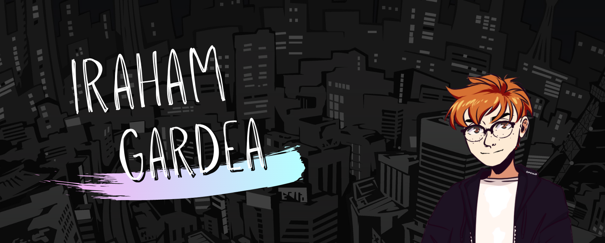
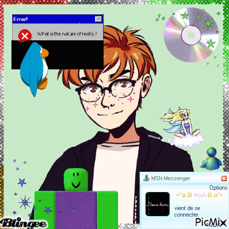
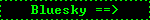

<h1 align="center">What's up?</h1>

    <em>"Everything sucks since Club Penguin closed" -Someone, maybe</em>

    I'm Iraham, Computer Systems Engineer and passionate about gaming, game dev, retro web and tech. Reclaim fun. Reject minimalism. 
    Languajes I speak: <b>Spanish</b> | English | And learning Japanese

    

 

<h2 align="center">Some Stats</h2>

    Don't focus on stats too much, just enjoy looking at the numbers go up.

 

<h2 align="center">Where to find me</h2>

